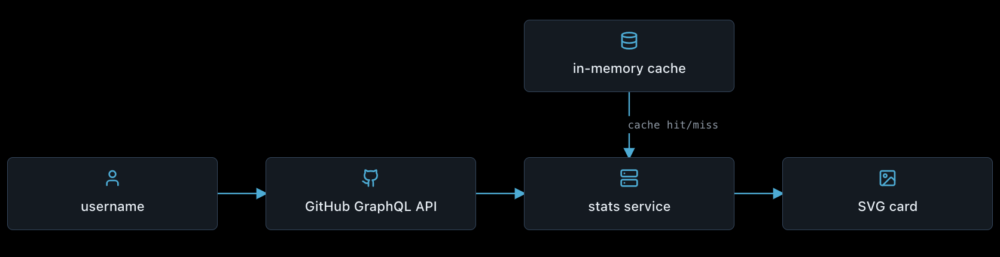

<div align="center">

# GitHub Stats

**A self-hosted Go service that turns GitHub profile activity into fast, embeddable SVG statistics cards.**

[Quick Start](#quick-start) ·
[Usage](#usage) ·
[Configuration](#configuration) ·
[API](#api) ·
[Development](#development)

</div>

> [!NOTE]
> GitHub Stats currently uses an in-memory cache. Cached data is cleared whenever
> the application restarts.

## What is GitHub Stats?

GitHub Stats is a small Go service that retrieves public profile statistics from
the GitHub GraphQL API and renders them as native SVG cards.

It is designed to be self-hosted and embedded in GitHub profiles, websites, or
other Markdown documents.

<p align="center">
  
</p>

## Features

- Native SVG card rendering
- GitHub GraphQL API integration
- Repository pagination
- Multiple card themes
- Cache-aside statistics service
- Per-entry in-memory cache expiration
- Request timeout and graceful shutdown
- Docker and Docker Compose support
- Health-check endpoint
- Concurrent access protection
- No JavaScript or browser rendering required

## Quick Start

### 1. Clone the repository

```shell
git clone https://github.com/mhmdnurf/github-stats.git
cd github-stats
```

### 2. Configure the application

Copy the example environment file:

```shell
cp .env.example .env
```

Add the GitHub username to display and your GitHub token:

```dotenv
GITHUB_USERNAME=mhmdnurf
GITHUB_TOKEN=your_github_token
HTTP_ADDRESS=:9000
```

Without `GITHUB_USERNAME`, the server fails during startup.

> [!WARNING]
> Never commit `.env` or expose your GitHub token in client-side code, logs, or
> public documentation.

### 3. Start with Docker Compose

```shell
docker compose up -d --build
```

Check the health endpoint:

```shell
curl http://localhost:9000/healthz
```

The service will be available at:

```text
http://localhost:9000
```

## Usage

Request the statistics card for the configured GitHub username:

```text
http://localhost:9000/stats
```

Embed the card in Markdown:

```markdown

```

Select a theme with the `theme` query parameter:

```text
http://localhost:9000/stats?theme=light
```

The GitHub username is configured through `GITHUB_USERNAME` and cannot be
overridden through query parameters.

### Query Parameters

| Parameter | Required | Default   | Description    |
|-----------|----------|-----------|----------------|
| `theme`   | No       | `default` | SVG card theme |

## Statistics

The generated card includes:

| Statistic       | Meaning                                                   |
|-----------------|-----------------------------------------------------------|
| Repositories    | Public owned repositories, including forks                |
| Stars           | Stars aggregated across public owned repositories         |
| Commits         | Contributions from approximately the previous 12 months   |
| Pull requests   | Pull request contribution count                            |
| Followers       | Current public follower count                              |

## Themes

The currently available themes are:

- `default`
- `light`

Unknown themes return an HTTP `400 Bad Request` response.

## API

### Generate a statistics card

```http
GET /stats?theme={theme}
```

A successful request returns:

```http
Content-Type: image/svg+xml
```

Possible error responses include:

| Status | Meaning                              |
|--------|--------------------------------------|
| `400`  | Unknown theme                        |
| `404`  | Configured GitHub user was not found |
| `504`  | GitHub request exceeded the deadline |
| `500`  | Unexpected server error              |

### Health check

```http
GET /healthz
```

Returns `200 OK` when the server is running.

## Configuration

| Variable          | Required | Default | Description                          |
|-------------------|----------|---------|--------------------------------------|
| `GITHUB_USERNAME` | Yes      | —       | GitHub account displayed by the card |
| `GITHUB_TOKEN`    | Yes      | —       | Token used for the GitHub API        |
| `HTTP_ADDRESS`    | No       | `:9000` | HTTP server listening address        |

Environment variables override values loaded from `.env`.

## Caching

GitHub responses are cached in memory to reduce API requests:

- Cache entries expire after 10 minutes
- Browser responses use a 5-minute cache duration
- Expired entries are removed lazily
- Cache access is safe for concurrent requests

Because the cache is stored in memory, it is not shared between application
instances and does not survive restarts.

## Docker

Build and start the application:

```shell
docker compose up -d --build
```

View application logs:

```shell
docker compose logs -f github-stats
```

Stop the application:

```shell
docker compose down
```

The container runs as a non-root user with a read-only filesystem, dropped Linux
capabilities, and the `no-new-privileges` security option.

## Development

### Requirements

- Go 1.26.5 or newer
- A GitHub personal access token
- Docker, if using the containerized setup

Run the application locally:

```shell
go run ./cmd/server
```

Run the complete test suite:

```shell
go test ./...
```

Run cache tests with the race detector:

```shell
go test -race ./internal/cache
```

Run all tests with the race detector:

```shell
go test -race ./...
```

Run static analysis:

```shell
go vet ./...
```

## Security

- Keep `GITHUB_TOKEN` out of version control
- Use a token with the minimum required permissions
- Rotate any token that appears in logs or terminal output
- Terminate HTTPS at a reverse proxy when exposing the service publicly
- Do not expose the application’s `.env` file through the container image

## License

GitHub Stats is available under the [MIT License](LICENSE).
