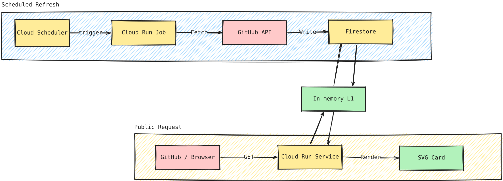

<div align="center">

# GitHub Stats

**A self-hosted Go service that turns GitHub profile activity into fast, embeddable SVG statistics cards.**

[Quick Start](#quick-start) ·
[Usage](#usage) ·
[Configuration](#configuration) ·
[API](#api) ·
[Deployment](#deployment) ·
[Development](#development)

</div>

> [!NOTE]
> Public card requests never call GitHub directly. They are served from
> persistent Firestore snapshots with an in-memory L1 cache.

## What is GitHub Stats?

GitHub Stats is a small Go application that periodically retrieves GitHub
profile statistics through a refresh job and renders persistent snapshots as
native SVG cards.

It is designed to be self-hosted and embedded in GitHub profiles, websites, or
other Markdown documents.

<p align="center">
  
</p>

## Features

- Native SVG card rendering
- Statistics and most-used-languages cards
- Scheduled GitHub GraphQL refresh
- Repository pagination
- Multiple card themes
- Persistent Firestore snapshots
- In-memory L1 cache with stale fallback
- Snapshot preload before serving traffic
- Cloud Run Job and Cloud Scheduler support
- Request timeout and graceful shutdown
- Docker and Docker Compose support
- Health-check endpoint
- Concurrent access protection
- No JavaScript or browser rendering required

## Quick Start

### 1. Clone the repository

```shell
git clone https://github.com/OWNER/github-stats.git
cd github-stats
```

### 2. Configure the application

Copy the example environment file:

```shell
cp .env.example .env
```

Add the GitHub username to display and your GitHub token:

```dotenv
GITHUB_USERNAME=your-github-username
GITHUB_TOKEN=your_github_token
GOOGLE_CLOUD_PROJECT=your-gcp-project
FIRESTORE_COLLECTION=github_stats_snapshots
HTTP_ADDRESS=:9000
```

The server uses Application Default Credentials to read Firestore. `GITHUB_TOKEN`
is also required by the server itself (not just the snapshot refresh command):
it powers the on-demand `/{username}/stats` and `/{username}/languages`
endpoints, which fetch live GitHub data directly instead of reading a
snapshot.

> [!WARNING]
> Never commit `.env` or expose your GitHub token in client-side code, logs, or
> public documentation.

### 3. Start with Docker Compose

Create Application Default Credentials and seed the snapshots once:

```shell
gcloud auth application-default login
go run ./cmd/refresh
```

The Compose configuration mounts the standard local `gcloud` ADC file as a
read-only container credential.

```shell
docker compose up -d --build
```

Check the health endpoint:

```shell
curl http://localhost:9000/health
```

The service will be available at:

```text
http://localhost:9000
```

## Usage

Request the statistics card for the configured GitHub username:

```text
http://localhost:9000/stats
```

Request the most-used-languages card:

```text
http://localhost:9000/languages
```

Embed the card in Markdown:

```markdown


```

When embedding cards outside your local machine, replace
`http://localhost:9000` with the public HTTPS URL of your deployment.

Select a theme with the `theme` query parameter:

```text
http://localhost:9000/stats?theme=light
```

### Query Parameters

| Parameter | Required | Default   | Description |
|-----------|----------|-----------|-------------|
| `theme` | No | `default` | SVG card theme for `/stats` and `/languages` |
| `repositories` | No | `public` | Repository scope: `public` or `all` |

Use `repositories=all` to include owned repositories that the configured
GitHub token can access:

```text
http://localhost:9000/stats?repositories=all
http://localhost:9000/languages?repositories=all
```

The GitHub username for `/stats` and `/languages` is configured through
`GITHUB_USERNAME` and cannot be overridden through query parameters.

### Cards for any GitHub username

Use the `/{username}/stats` and `/{username}/languages` endpoints to render a
card for any public GitHub account, not just the one configured by
`GITHUB_USERNAME`:

```text
http://localhost:9000/octocat/stats
http://localhost:9000/octocat/languages?theme=light
```

```markdown

```

These endpoints only support `repositories=public` (the default). Requesting
`repositories=all` returns `400 Bad Request`, because the server's GitHub
token cannot access another account's private repositories — self-host the
application with your own `GITHUB_TOKEN` and use `/stats?repositories=all` if
you need your private repository data included.

Unlike `/stats` and `/languages`, these endpoints are not preloaded at
startup and are not backed by the scheduled refresh job (see
[Caching](#caching)): the first request for a given username fetches live
data from the GitHub API and is rate-limited per client IP.

## Statistics

The statistics card includes:

| Statistic       | Meaning                                                   |
|-----------------|-----------------------------------------------------------|
| Repositories    | Owned repositories in the selected scope, including forks |
| Stars           | Stars aggregated across owned repositories in the selected scope |
| Commits         | Contributions from approximately the previous 12 months   |
| Pull requests   | Pull request contribution count                            |
| Followers       | Current public follower count                              |

The languages card shows up to five languages, ranked by their byte size.
It excludes forked and archived repositories; percentages are calculated from
all included languages in the selected repository scope.

## Themes

The currently available themes are:

- `default`
- `light`
- `dracula`
- `tokyonight`
- `gruvbox`

Unknown themes return an HTTP `400 Bad Request` response.

## API

### Generate a statistics card

```http
GET /stats?theme={theme}&repositories={public|all}
```

### Generate a languages card

```http
GET /languages?theme={theme}&repositories={public|all}
```

### Generate a card for any username

```http
GET /{username}/stats?theme={theme}&repositories=public
GET /{username}/languages?theme={theme}&repositories=public
```

`repositories=all` is rejected on these endpoints; see
[Cards for any GitHub username](#cards-for-any-github-username).

A successful request returns:

```http
Content-Type: image/svg+xml
```

Possible error responses include:

| Status | Meaning                              |
|--------|--------------------------------------|
| `400`  | Unknown theme, invalid `repositories` value, invalid `{username}`, or `repositories=all` on a `/{username}` endpoint |
| `404`  | GitHub user not found (`/{username}` endpoints only) |
| `429`  | Rate limit exceeded (`/{username}` endpoints only) |
| `503`  | A snapshot is not available yet (`/stats` and `/languages` only) |
| `504`  | Snapshot storage or GitHub request exceeded the deadline |
| `500`  | Unexpected server error              |

### Health check

```http
GET /health
```

Returns `200 OK` when the server is running.

## Configuration

| Variable | Required | Default | Description |
|---|---|---|---|
| `GITHUB_USERNAME` | Yes | — | GitHub account displayed by the card |
| `GITHUB_TOKEN` | Yes | — | Token used by the refresh job and by the server's `/{username}` endpoints |
| `GOOGLE_CLOUD_PROJECT` | Yes | — | Project containing Firestore |
| `FIRESTORE_COLLECTION` | No | `github_stats_snapshots` | Snapshot collection |
| `HTTP_ADDRESS` | No | `:9000` | HTTP server listening address |

Environment variables override values loaded from `.env`.

### GitHub token access

The GitHub GraphQL API requires an access token. Grant the token only the
minimum read access required by your deployment:

- For `repositories=public`, the token only needs access to public data.
- For `repositories=all`, private repository aggregates are included only when
  the token can access those repositories.
- Prefer a fine-grained token restricted to the repositories you intend to
  include, and never commit the token to the repository.

Each deployment serves the single account configured by `GITHUB_USERNAME` on
`/stats` and `/languages`; the username cannot be changed through a request
query parameter on those endpoints. The `/{username}/stats` and
`/{username}/languages` endpoints can serve any public GitHub account with
the same token, restricted to `repositories=public` (see
[Cards for any GitHub username](#cards-for-any-github-username)).

## Caching

`/stats` and `/languages` never call GitHub directly at request time. A
scheduled refresh job writes stats and language snapshots to Firestore every
15 minutes for the configured `GITHUB_USERNAME`. The server loads those
snapshots into an in-memory L1 cache and falls back to stale memory data if
Firestore has a temporary error. Browser responses use a 5-minute cache
duration.

`/{username}/stats` and `/{username}/languages` are not preloaded and are not
covered by the scheduled refresh job. Each request fetches live data from the
GitHub API on demand (through the same L1/Firestore snapshot layer, keyed per
username) and is subject to per-client-IP rate limiting to protect the
shared `GITHUB_TOKEN` quota.

## Docker

Build and start the application:

```shell
docker compose up -d --build
```

View application logs:

```shell
docker compose logs -f github-stats
```

Stop the application:

```shell
docker compose down
```

The container runs as a non-root user with a read-only filesystem, dropped Linux
capabilities, and the `no-new-privileges` security option.

## Deployment

Choose the deployment approach that matches your infrastructure.

| Mode | Best for | Requirements |
|---|---|---|
| Docker Compose | Local use or an existing server | Docker, Docker Compose, and a Firestore database |
| Google Cloud Run | Managed public hosting and GitHub Actions deployment | A billed Google Cloud project, `gcloud`, and Terraform |

### Conventional Docker deployment

For a VPS, a self-managed server, or any platform that runs Docker, create a
local `.env`, authenticate Application Default Credentials, and seed Firestore
before starting the server:

```shell
gcloud auth application-default login
go run ./cmd/refresh

docker build -t github-stats .
docker run -d \
  --name github-stats \
  --restart unless-stopped \
  --env-file .env \
  -e GOOGLE_APPLICATION_CREDENTIALS=/var/run/secrets/google/adc.json \
  -v \
  "${HOME}/.config/gcloud/application_default_credentials.json:/var/run/secrets/google/adc.json:ro" \
  -p 9000:9000 \
  github-stats
```

On platforms outside Google Cloud, provide an equivalent ADC-compatible
credential instead of the local `gcloud` credential file. Never bake that
credential into the image.

The service is then available at `http://localhost:9000`. In production, place
it behind an HTTPS reverse proxy and expose only the proxy publicly. Configure
the proxy or hosting platform to use `/health` for health checks. The
`/{username}/stats` and `/{username}/languages` endpoints apply a per-client-IP
rate limit in the application itself; `/stats` and `/languages` are served
from cached snapshots and are not rate-limited. Consider adding
proxy-level rate limiting as well when the service is publicly accessible.
Docker Compose is also supported; see the [Docker](#docker) section.

### Google Cloud Run with Terraform

This repository includes an optional Terraform deployment for Google Cloud
users. It provisions Artifact Registry, Secret Manager, Firestore, Cloud Run
service accounts, a scheduled refresh job, Workload Identity Federation for
GitHub Actions, and the Cloud Run service. The deployment script seeds
Firestore before rolling out the server image.

The default deployment creates three operational resources:

- `github-stats`: public Cloud Run Service
- `github-stats-refresh`: private Cloud Run Job
- `github-stats-refresh-schedule`: 15-minute Cloud Scheduler trigger

#### Prerequisites

- A Google Cloud project with billing enabled
- Google Cloud CLI
- Terraform 1.7 or newer
- Permission to enable APIs and manage IAM, service accounts, Storage,
  Artifact Registry, Firestore, Secret Manager, Cloud Run, and Cloud Scheduler

Using Project Owner for the initial bootstrap is the simplest option. If you do
so, remove that broad access afterward and use the generated deployer service
account for routine GitHub Actions deployments.

#### Configure your fork

Fork the repository, follow the [Quick Start](#quick-start), and add these
deployment settings to the local `.env`:

```dotenv
GITHUB_REPOSITORY=OWNER/github-stats
PROJECT_ID=your-gcp-project
GOOGLE_CLOUD_PROJECT=your-gcp-project
REGION=asia-southeast2
SERVICE_NAME=github-stats
TF_STATE_BUCKET=your-globally-unique-terraform-state-bucket
```

`PROJECT_ID` configures the deployment tooling. `GOOGLE_CLOUD_PROJECT`
configures the application when it runs outside Terraform. They normally have
the same value. Keep `.env` local; it is ignored by Git and must never be
committed.

Load the settings into the current shell:

```shell
set -a
source .env
set +a
```

The refresh job uses the GitHub GraphQL API. Public-only statistics require
access to public GitHub data. Private repository aggregates require read access
to the selected private repositories. Prefer a fine-grained token restricted
to the repositories you intend to include.

Authenticate both the Google Cloud CLI and the Terraform provider:

```shell
gcloud auth login
gcloud auth application-default login
gcloud config set project "$PROJECT_ID"
```

#### First deployment

Run from the repository root:

```shell
./scripts/deploy.sh
```

The first deployment:

1. Creates the versioned GCS Terraform state bucket if needed.
2. Enables the required Google Cloud APIs.
3. Creates dedicated runtime, refresh, scheduler, deployer, and builder service
   accounts.
4. Configures Workload Identity Federation for your fork.
5. Stores the GitHub token in Secret Manager.
6. Builds the container with Cloud Build.
7. Runs the initial refresh job.
8. Deploys the public Cloud Run service and scheduler.

The state bucket name must be globally unique. Fresh installations write state
to:

```text
gs://STATE_BUCKET/bootstrap/default.tfstate
gs://STATE_BUCKET/app/default.tfstate
```

#### Configure GitHub Actions

Read the generated bootstrap outputs:

```shell
terraform -chdir=terraform/bootstrap output -raw workload_identity_provider
terraform -chdir=terraform/bootstrap output -raw deployer_service_account
```

In the fork, open **Settings → Secrets and variables → Actions → Variables** and
add:

| Variable | Required | Value |
|---|---:|---|
| `GCP_PROJECT_ID` | Yes | Google Cloud project ID |
| `GH_USERNAME` | Yes | GitHub account displayed by the cards |
| `GCP_WIF_PROVIDER` | Yes | `workload_identity_provider` Terraform output |
| `GCP_DEPLOY_SERVICE_ACCOUNT` | Yes | `deployer_service_account` Terraform output |
| `GCP_REGION` | No | Defaults to `asia-southeast2` |
| `GCP_SERVICE_NAME` | No | Defaults to `github-stats` |
| `GCP_TF_STATE_BUCKET` | No | Required only when it differs from `${PROJECT_ID}-${SERVICE_NAME}-tfstate` |

The workflow uses GitHub's built-in `GITHUB_REPOSITORY` value, so a fork is
restricted to its own `OWNER/repository` identity after the local bootstrap.
It deploys on pushes to `main` and can also be run manually from the Actions
tab. It does not store a Google service-account key or GitHub token.

#### Verify the deployment

Get the service URL and check its health:

```shell
SERVICE_URL="$(gcloud run services describe "$SERVICE_NAME" \
  --project="$PROJECT_ID" \
  --region="$REGION" \
  --format='value(status.url)')"
curl "${SERVICE_URL}/health"
```

Check the latest refresh execution:

```shell
gcloud run jobs executions list \
  --project="$PROJECT_ID" \
  --region="$REGION" \
  --job="${SERVICE_NAME}-refresh" \
  --limit=1
```

Verify remote Terraform state:

```shell
gcloud storage ls --recursive "gs://${TF_STATE_BUCKET}/**"
terraform -chdir=terraform/bootstrap state list
terraform -chdir=terraform/app state list
```

#### Updating an installation

Routine pushes deploy application changes through GitHub Actions. Changes to
`terraform/bootstrap` must first be applied locally by an administrator:

```shell
terraform -chdir=terraform/bootstrap init -reconfigure \
  -backend-config="bucket=${TF_STATE_BUCKET}" \
  -backend-config="prefix=bootstrap"
terraform -chdir=terraform/bootstrap plan \
  -var="project_id=${PROJECT_ID}" \
  -var="github_repository=${GITHUB_REPOSITORY}" \
  -var="retain_legacy_runtime_secret_access=false"
terraform -chdir=terraform/bootstrap apply \
  -var="project_id=${PROJECT_ID}" \
  -var="github_repository=${GITHUB_REPOSITORY}" \
  -var="retain_legacy_runtime_secret_access=false"
```

Review every plan before applying it.

#### Existing installations with local state

This applies only to installations created before the GCS backend was added.
Fresh forks should skip it. Back up both local state files, then migrate them:

```shell
cp terraform/bootstrap/terraform.tfstate \
  terraform/bootstrap/terraform.tfstate.backup-manual
cp terraform/app/terraform.tfstate \
  terraform/app/terraform.tfstate.backup-manual
terraform -chdir=terraform/bootstrap init -migrate-state \
  -backend-config="bucket=${TF_STATE_BUCKET}" \
  -backend-config="prefix=bootstrap"
terraform -chdir=terraform/app init -migrate-state \
  -backend-config="bucket=${TF_STATE_BUCKET}" \
  -backend-config="prefix=app"
```

Do not use `-reconfigure` for the first migration because it does not copy
local state into the new backend.

#### Operations and security

- Google Cloud resources can incur charges. Review Cloud Run, Cloud Build,
  Firestore, Artifact Registry, Scheduler, Secret Manager, and Storage pricing.
- Keep the Terraform state bucket private; state can contain sensitive
  metadata.
- Keep local state backups until a full deployment succeeds.
- Rotate the GitHub token by adding a new Secret Manager version.
- Do not grant the runtime service account access to the GitHub token.
- Review a full `terraform plan` before changing or removing infrastructure.
- Firestore deletion protection is enabled. Cleanup requires an explicit,
  separately reviewed change.

#### Troubleshooting

| Symptom | Check |
|---|---|
| Authentication fails before deployment | Confirm `GCP_WIF_PROVIDER` and `GCP_DEPLOY_SERVICE_ACCOUNT` match outputs from the same project |
| `PROJECT_ID` or username is missing | Confirm `GCP_PROJECT_ID` and `GH_USERNAME` exist as repository variables |
| Cloud Build cannot access its bucket | Reapply `terraform/bootstrap` and verify the builder bucket IAM bindings |
| Cloud Run cannot read the image | Verify the deployer has Artifact Registry Reader on the image repository |
| Terraform reports that a resource already exists | Verify both GCS state objects exist and the workflow uses the same state bucket |
| The service returns `503` | Confirm the refresh job completed and snapshots exist in Firestore |

For deeper diagnostics, inspect the failing GitHub Actions step, its linked
Cloud Build log, and the corresponding Terraform state before changing IAM or
importing resources. See [terraform/README.md](terraform/README.md) for the
Terraform reference.

## Development

### Requirements

- Go 1.26.5 or newer
- A Google Cloud project with Firestore
- Google Cloud CLI and Application Default Credentials
- A GitHub personal access token
- Docker, if using the containerized setup

Authenticate, seed snapshots, and then run the application locally:

```shell
gcloud auth application-default login
go run ./cmd/refresh
go run ./cmd/server
```

Run the complete test suite:

```shell
go test ./...
```

Run snapshot and HTTP-path tests with the race detector:

```shell
go test -race ./internal/snapshot ./internal/handler ./cmd/server
```

Run all tests with the race detector:

```shell
go test -race ./...
```

Run static analysis:

```shell
go vet ./...
```

## Security

- Keep `GITHUB_TOKEN` out of version control
- Prefer attached service accounts or Workload Identity Federation over JSON
  keys
- Keep the public server identity read-only in Firestore
- Use a token with the minimum required permissions
- Use `repositories=all` only when you intend to expose its aggregate data
- `/{username}/stats` and `/{username}/languages` always reject
  `repositories=all`; self-host with your own `GITHUB_TOKEN` if you need
  private repository data for your own account
- The application rate-limits `/{username}/stats` and
  `/{username}/languages` per client IP; consider additional rate limiting
  at the reverse proxy or cloud platform for public services
- Rotate any token that appears in logs or terminal output
- Terminate HTTPS at a reverse proxy when exposing the service publicly
- Do not expose the application’s `.env` file through the container image

## License

GitHub Stats is available under the [MIT License](LICENSE).
